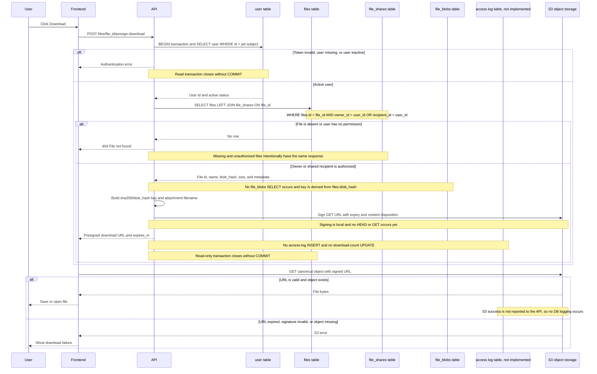

# Detailed File Download Sequence

This diagram documents the implemented presigned-download flow. The application
does not currently have an access-log table or a download-count column, so no
download logging `INSERT` or counter `UPDATE` occurs.

## Requested-operation mapping

| Requested operation | Current implementation |
| --- | --- |
| Metadata existence | Authorized lookup in `files` |
| Permission | `files.owner_id` or matching `file_shares.recipient_id` |
| Physical existence | Determined by the direct S3 `GET`; the API does not call `HEAD` |
| Retrieval | Frontend downloads through a presigned S3 URL; the API does not stream bytes |
| Access log / download count | Not implemented; no table or counter participates |
