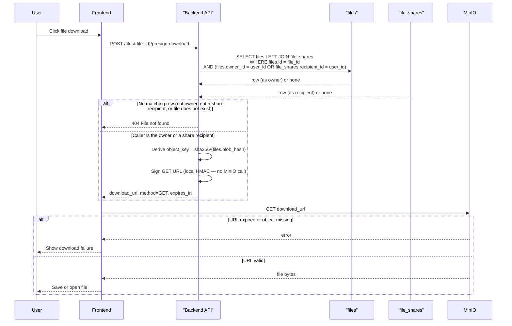
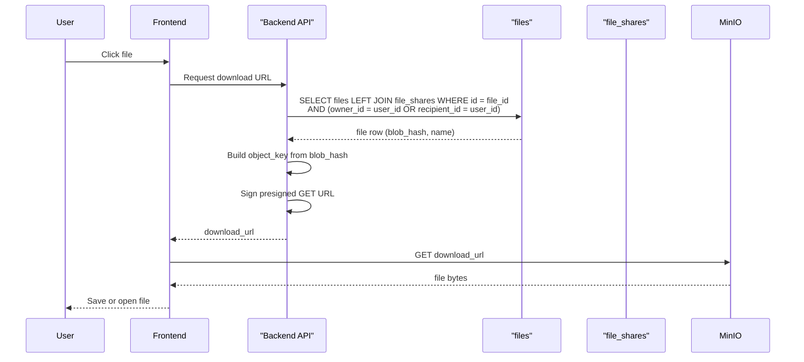
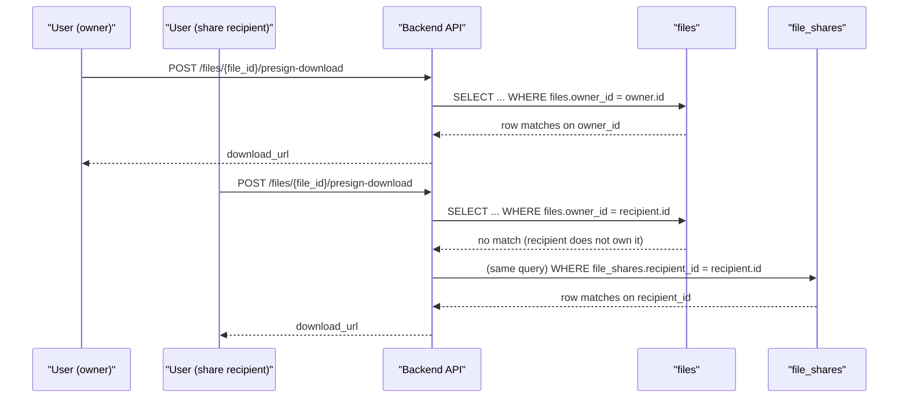

# File Download Flow

This diagram shows the download flow using presigned URLs. The backend authorizes access with a
single query; the browser then downloads file bytes directly from MinIO. Presigned URL generation is
local HMAC signing — it never makes a network call to MinIO.

Two Postgres tables are involved:

| Table | Role |
| --- | --- |
| `files` | The file's metadata row, including `owner_id` and `blob_hash` |
| `file_shares` | Grants a non-owner recipient access to someone else's file |

Both are read in one query — `get_downloadable_file_by_id` outer-joins `files` to `file_shares` so a
caller who is either the owner or a share recipient resolves the file in a single round trip; anyone
else gets no row, which the route maps to 404, never 403.

## Full flow

## Happy path

## Ownership vs. share access

`file_shares` is only consulted when the caller is not the file's owner. Both paths return the exact
same 200 response shape — the recipient cannot tell from the API whether they were granted access or
own the file outright.

