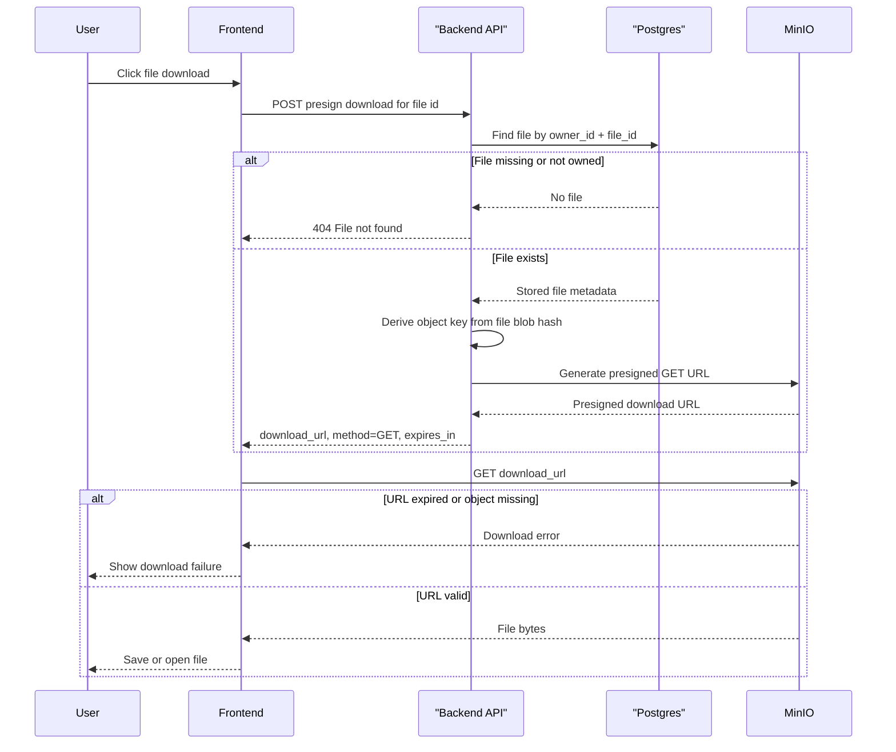
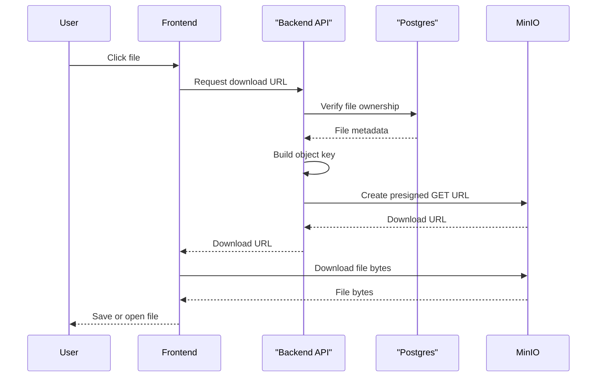

# File Download Flow

This diagram shows the Phase 2 download flow using presigned URLs. The backend authorizes access; the browser downloads file bytes directly from MinIO.

```mermaid
sequenceDiagram
    participant User
    participant Frontend
    participant Backend as "Backend API"
    participant DB as "Postgres"
    participant MinIO

    User->>Frontend: Click file download
    Frontend->>Backend: POST presign download for file id

    Backend->>DB: Find file by owner_id + file_id
    alt File missing or not owned
        DB-->>Backend: No file
        Backend-->>Frontend: 404 File not found
    else File exists
        DB-->>Backend: Stored file metadata
        Backend->>Backend: Derive object key from file blob hash
        Backend->>MinIO: Generate presigned GET URL
        MinIO-->>Backend: Presigned download URL
        Backend-->>Frontend: download_url, method=GET, expires_in
    end

    Frontend->>MinIO: GET download_url
    alt URL expired or object missing
        MinIO-->>Frontend: Download error
        Frontend-->>User: Show download failure
    else URL valid
        MinIO-->>Frontend: File bytes
        Frontend-->>User: Save or open file
    end
```

## Happy Path

```mermaid
sequenceDiagram
    participant User
    participant Frontend
    participant Backend as "Backend API"
    participant DB as "Postgres"
    participant MinIO

    User->>Frontend: Click file
    Frontend->>Backend: Request download URL
    Backend->>DB: Verify file ownership
    DB-->>Backend: File metadata
    Backend->>Backend: Build object key
    Backend->>MinIO: Create presigned GET URL
    MinIO-->>Backend: Download URL
    Backend-->>Frontend: Download URL
    Frontend->>MinIO: Download file bytes
    MinIO-->>Frontend: File bytes
    Frontend-->>User: Save or open file
```
