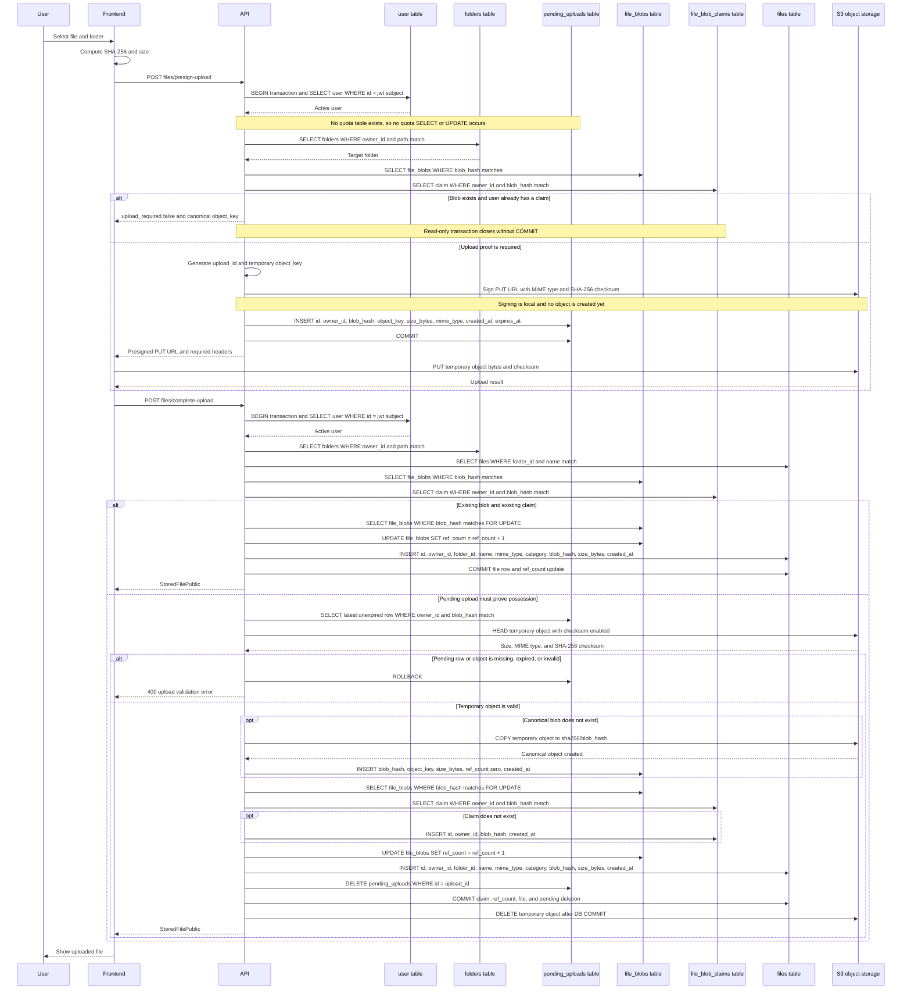

# Detailed File Upload Sequence

This diagram documents the upload flow as currently implemented. Table names
match the production schema. The application does not have `files_metadata`,
`storage_usage`, a quota table, or a file status column. The temporary state is
represented by `pending_uploads`; the durable `files` row is inserted only after
the object has been verified.

## Requested-state mapping

| Requested state or operation | Current implementation |
| --- | --- |
| Quota check | Not implemented; there is no quota or `storage_usage` table |
| Initial `PENDING` metadata | `pending_uploads` row and temporary S3 object |
| Final `COMPLETED` metadata | Committed `files` row referencing `file_blobs`; no status field exists |
| Physical upload | Direct frontend `PUT` to a temporary S3 key |
| Final physical object | Content-addressed `sha256/blob_hash` S3 key |
