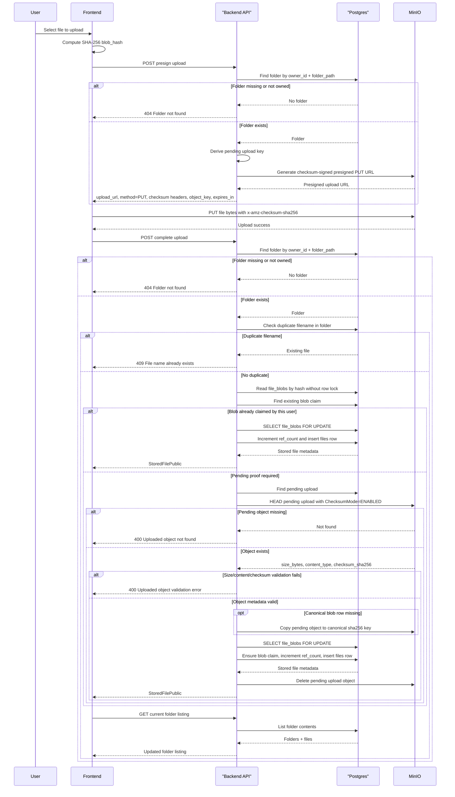
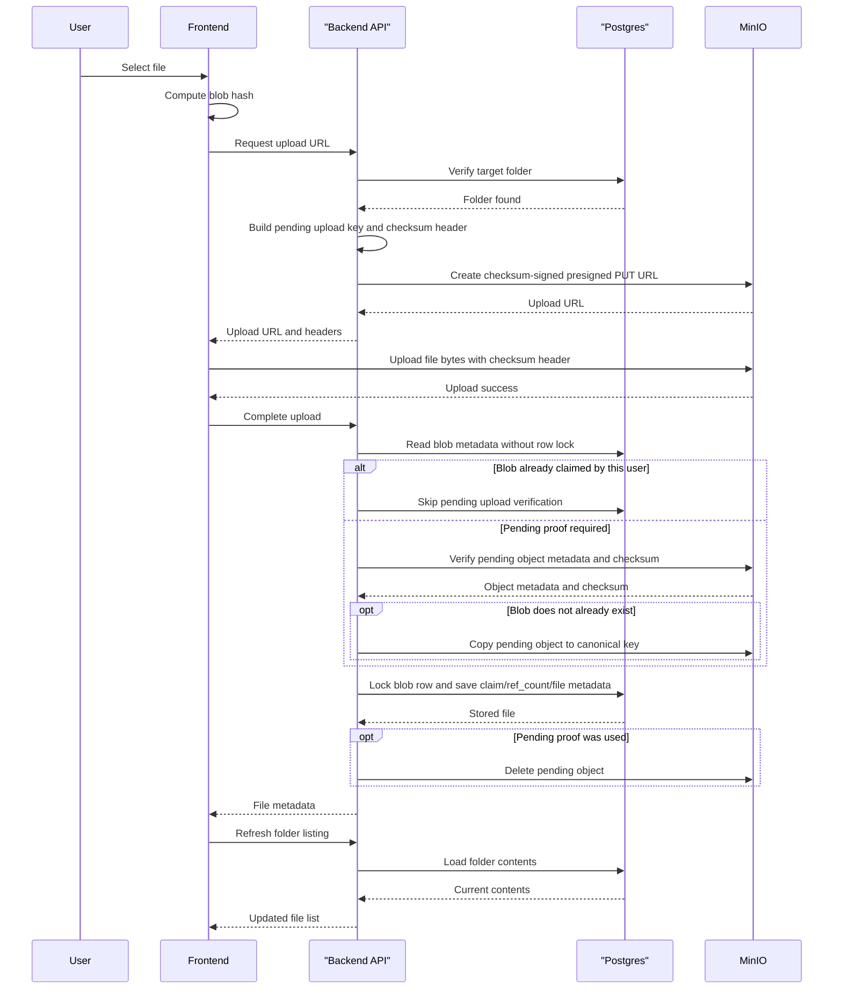

# File Upload Flow

This diagram shows the Phase 2 upload flow using presigned URLs. The backend authorizes the operation and stores metadata; the browser uploads file bytes directly to MinIO. Upload completion verifies object metadata before taking the `file_blobs` row lock; the lock is held only while mutating blob claims, ref counts, and file metadata.

## Happy Path

