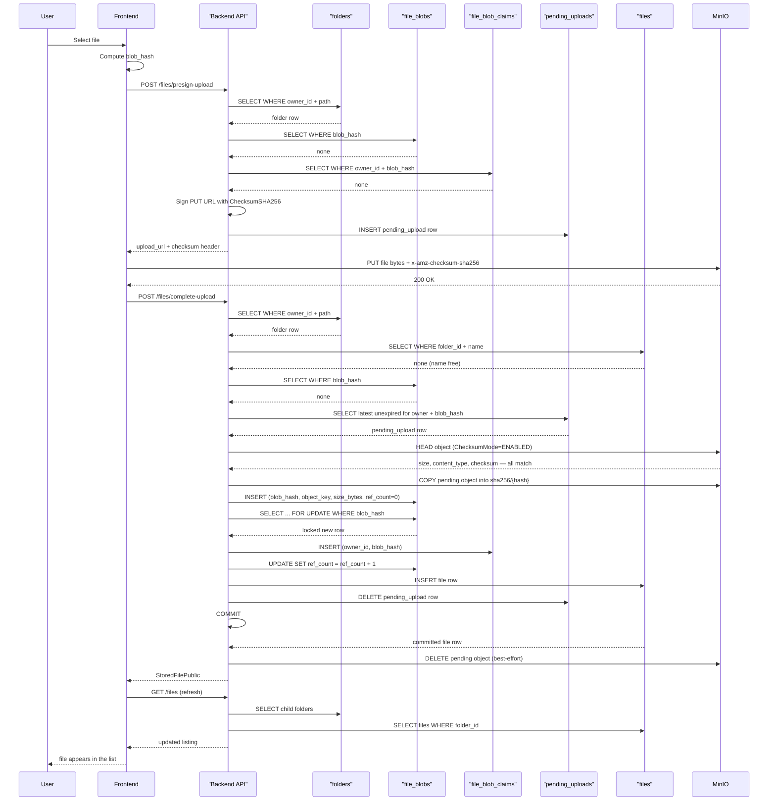

# File Upload Flow

This diagram shows the current upload flow using presigned URLs with S3-side checksum verification
(ROADMAP 2.6 / #91) and delayed blob row locking (ROADMAP 2.7 / #92). The backend authorizes the
operation and stores metadata; the browser uploads file bytes directly to MinIO. Presigned URL
generation is local HMAC signing — it never makes a network call to MinIO.

Five Postgres tables are involved, each shown as its own lifeline so every step names exactly which
table is read or written:

| Table | Role |
| --- | --- |
| `folders` | Resolves the target folder by owner + path |
| `file_blobs` | One row per distinct object (`blob_hash`), holds `ref_count` |
| `file_blob_claims` | Proves *this* user legitimately possesses a blob's content — the SCALE 8.1 fix |
| `pending_uploads` | Tracks an in-flight upload until `complete_upload` consumes it |
| `files` | The metadata row a folder listing actually reads |

## Full flow

```mermaid
sequenceDiagram
    participant User
    participant Frontend
    participant Backend as "Backend API"
    participant folders as "folders"
    participant file_blobs as "file_blobs"
    participant file_blob_claims as "file_blob_claims"
    participant pending_uploads as "pending_uploads"
    participant files as "files"
    participant MinIO

    User->>Frontend: Select file to upload
    Frontend->>Frontend: Compute SHA-256 blob_hash (chunked)
    Frontend->>Backend: POST /files/presign-upload

    Backend->>folders: SELECT WHERE owner_id + path
    alt Folder missing or not owned
        folders-->>Backend: no row
        Backend-->>Frontend: 404 Folder not found
    else Folder exists
        folders-->>Backend: folder row
        Backend->>file_blobs: SELECT WHERE blob_hash (no lock)
        file_blobs-->>Backend: blob row or none
        Backend->>file_blob_claims: SELECT WHERE owner_id + blob_hash
        file_blob_claims-->>Backend: claim row or none

        alt Blob exists AND already claimed by this user
            Backend-->>Frontend: upload_required=false, object_key
            Note over Frontend,MinIO: Bytes already in storage under this user's<br/>claim — the PUT to MinIO is skipped entirely
        else Upload actually required
            Backend->>Backend: Sign PUT URL with ChecksumSHA256<br/>(local HMAC — no MinIO call)
            Backend->>pending_uploads: INSERT (upload_id, owner_id, blob_hash,<br/>object_key, size_bytes, mime_type, expires_at)
            pending_uploads-->>Backend: row committed
            Backend-->>Frontend: upload_url, method=PUT,<br/>x-amz-checksum-sha256 header, object_key, expires_in
            Frontend->>MinIO: PUT file bytes + x-amz-checksum-sha256
            MinIO-->>Frontend: 200 OK (checksum verified S3-side)
        end
    end

    Frontend->>Backend: POST /files/complete-upload

    Backend->>folders: SELECT WHERE owner_id + path
    alt Folder missing or not owned
        folders-->>Backend: no row
        Backend-->>Frontend: 404 Folder not found
    else Folder exists
        folders-->>Backend: folder row
        Backend->>files: SELECT WHERE folder_id + name
        alt Duplicate filename in folder
            files-->>Backend: existing row
            Backend-->>Frontend: 409 File name already exists
        else Name is free
            files-->>Backend: no row
            Backend->>file_blobs: SELECT WHERE blob_hash (no lock)
            file_blobs-->>Backend: blob row or none
            Backend->>file_blob_claims: SELECT WHERE owner_id + blob_hash
            file_blob_claims-->>Backend: claim row or none

            alt Blob exists AND already claimed
                Note over Backend,pending_uploads: No pending_uploads lookup — the claim<br/>alone is proof this user owns the content
            else Blob missing, or exists but not yet claimed by this user
                Backend->>pending_uploads: SELECT WHERE owner_id + blob_hash<br/>AND expires_at > now() ORDER BY created_at DESC
                alt No unexpired pending upload
                    pending_uploads-->>Backend: no row
                    Backend-->>Frontend: 400 Uploaded object not found
                else Pending upload found
                    pending_uploads-->>Backend: pending_upload row
                    Backend->>MinIO: HEAD pending object (ChecksumMode=ENABLED)
                    alt Object missing from storage
                        MinIO-->>Backend: not found
                        Backend-->>Frontend: 400 Uploaded object not found
                    else Object present
                        MinIO-->>Backend: size_bytes, content_type, checksum_sha256
                        alt size / content-type / checksum mismatch
                            Backend-->>Frontend: 400 validation error
                        else Object metadata matches the request
                            opt Blob row does not exist yet
                                Backend->>MinIO: COPY pending object into canonical sha256/{hash} key
                                Backend->>file_blobs: INSERT (blob_hash, object_key,<br/>size_bytes, ref_count=0)
                                Note over file_blobs: Duplicate INSERT from a concurrent<br/>uploader is caught and ignored
                            end
                        end
                    end
                end
            end

            Backend->>file_blobs: SELECT ... FOR UPDATE WHERE blob_hash
            file_blobs-->>Backend: locked blob row
            Note over Backend,file_blobs: Row lock held only from here to the<br/>commit below (#92) — not for the whole request

            Backend->>file_blob_claims: INSERT WHERE NOT EXISTS (owner_id, blob_hash)
            Note over file_blob_claims: No-op SELECT if already claimed
            Backend->>file_blobs: UPDATE SET ref_count = ref_count + 1
            Backend->>files: INSERT (owner_id, folder_id, name, blob_hash,<br/>size_bytes, mime_type, category)
            opt Pending upload was used
                Backend->>pending_uploads: DELETE WHERE id
            end
            Backend->>Backend: COMMIT<br/>(file_blob_claims + file_blobs + files + pending_uploads<br/>together, one transaction)
            files-->>Backend: committed file row

            opt Pending upload was used
                Backend->>MinIO: DELETE pending object (best-effort,<br/>outside the transaction — failure is logged, not fatal)
            end
            Backend-->>Frontend: StoredFilePublic

            Frontend->>Backend: GET /files (refresh current folder)
            Backend->>folders: SELECT child folders WHERE parent_id
            Backend->>files: SELECT files WHERE folder_id
            folders-->>Backend: child folders
            files-->>Backend: files
            Backend-->>Frontend: updated folder listing
            Frontend-->>User: file appears in the list
        end
    end
```

## Happy path (blob not previously seen)

The common case for a genuinely new file: no existing blob, no existing claim, a real PUT to MinIO,
then a canonical blob row created at completion time.

