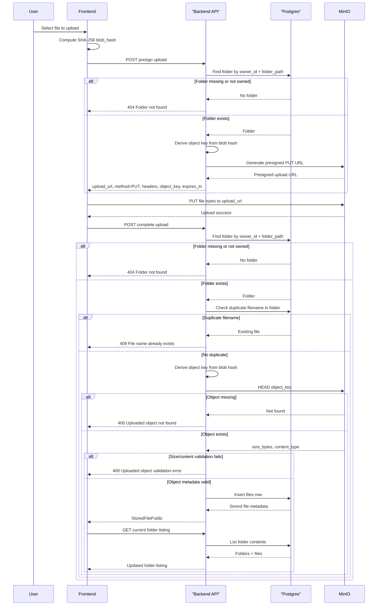
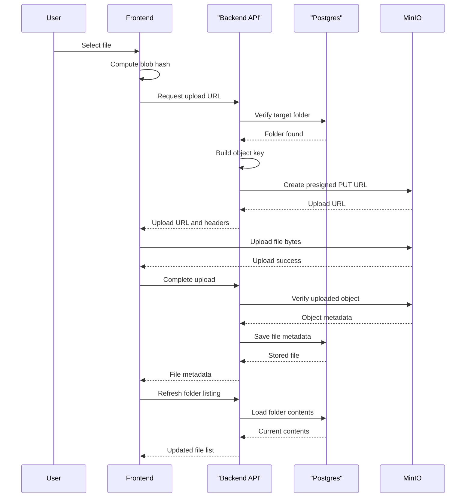

# File Upload Flow

This diagram shows the Phase 2 upload flow using presigned URLs. The backend authorizes the operation and stores metadata; the browser uploads file bytes directly to MinIO.

## Happy Path

