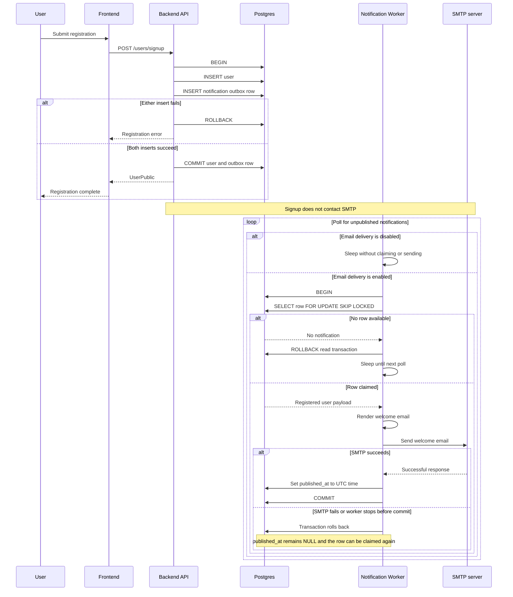

# Notification Flow

This diagram shows notification Slice 1 for user registration. The API stores
the user and welcome-email intent atomically, then returns without contacting
SMTP. A separate worker claims and delivers unpublished notifications.

The worker holds the row lock while sending. Other worker instances skip the
locked row, while a crash or SMTP failure rolls back the transaction and leaves
the notification eligible for a later delivery attempt.
