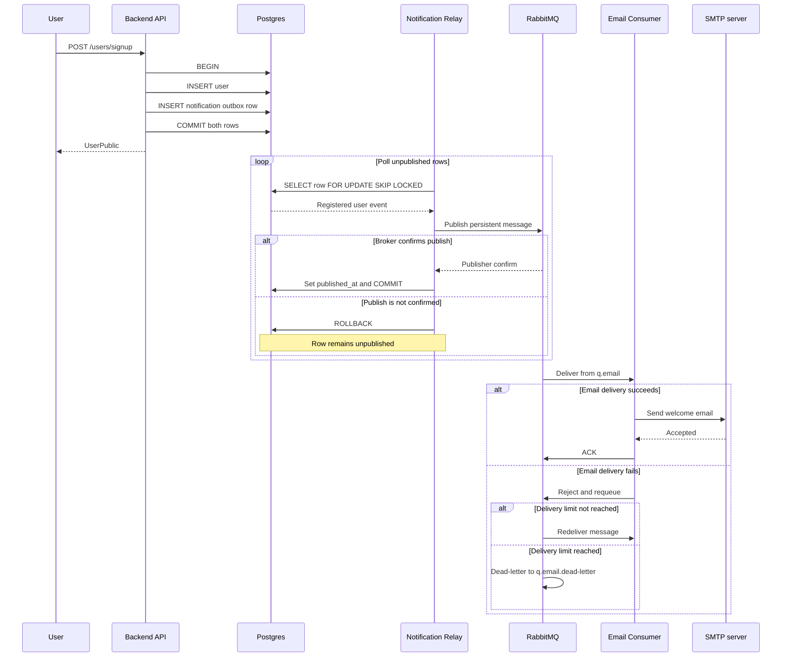

# Notification Flow

This diagram shows the broker-backed notification flow. Registration remains
independent of SMTP: the API commits the user and outbox row together, the relay
moves the event to RabbitMQ, and the email consumer performs delivery.

The `notifications` topic exchange, `q.email`, and dead-letter topology are
durable. Messages are persistent and the broker data directory is backed by a
named volume. Delivery is at-least-once: a relay crash after broker confirmation
but before the database commit can publish the same event again.
