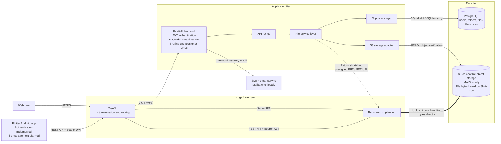
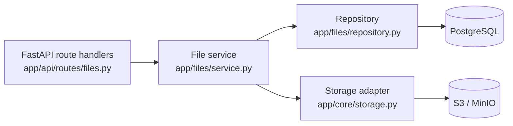
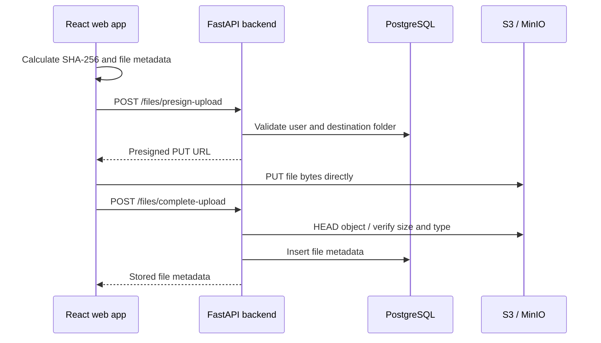
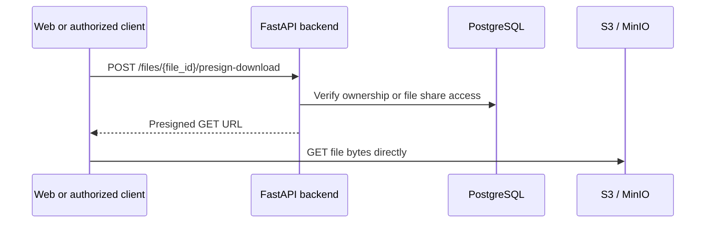

# High-Level Architecture

This document describes the current high-level architecture of Cloud File Storage.
It focuses on runtime components and the main request and file-transfer paths.

## System architecture



## Main architectural idea

The backend is the **control plane** for authentication, authorization, folder and
file metadata, sharing rules, and generation of short-lived presigned URLs.
PostgreSQL stores application metadata, while the actual file bytes live in
S3-compatible object storage.

File bytes do **not** normally pass through the FastAPI service. The web client
uploads and downloads directly to/from object storage using presigned URLs. This
keeps API instances out of the high-bandwidth file-transfer path.

## Backend layering

The file-management backend is separated by responsibility:



- **Routes** translate HTTP requests/responses and domain errors.
- **Service layer** implements file/folder ownership, sharing, upload-completion,
  and presign workflows.
- **Repository layer** owns database queries and persistence.
- **Storage adapter** isolates S3-compatible operations and presigned URL creation.

## Upload flow



Object keys are content-addressed using the current pattern:

```text
sha256/<blob_hash>
```

## Download flow



## Authentication

The FastAPI backend authenticates users with email/password and issues JWT access
tokens. Authenticated API requests use:

```text
Authorization: Bearer <access-token>
```

The React application uses the backend API for authenticated operations. The
Flutter Android client currently supports sign-in, secure token persistence,
session restoration, and sign-out; Android file management and synchronization
are planned rather than part of the current implementation.

## Deployment and local development

Production-style Compose configuration contains the core services:

- Traefik
- React frontend
- FastAPI backend
- PostgreSQL
- a prestart/migration task

The local Compose override additionally provides development infrastructure such
as MinIO, Mailcatcher, Adminer, and Playwright. MinIO is the local
S3-compatible implementation used by the direct file-transfer flow.
