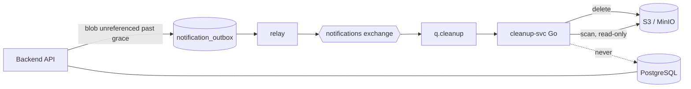

# Phase 13: Cleanup service

## Goal

Introduce `cleanup-svc`, a separately deployable Go service that owns
object-storage hygiene: reporting objects that have leaked, and deleting objects
the backend has declared unreferenced.

It is written in Go deliberately, partly to gain experience with the language.
That is recorded as a real input to the decision rather than left implicit — the
slicing below is arranged so the risky half is not the half being learned on.

This advances ROADMAP 7.4 (asynchronous cleanup for objects with no metadata
reference) and covers **SCALE 5.2**.

## Product and technical decisions

1. **`cleanup-svc` is a separate deployable, in Go.** The justification is the
   same shape as `search-svc`: it faces object storage, needs none of the
   application schema, and is driven by events. It is not a channel consumer
   bolted into the backend package, because unlike the notification workers it
   writes to no table the backend owns.

2. **`cleanup-svc` never reads PostgreSQL.** It is given no database credentials.
   Everything it needs arrives in an event or is read from object storage. This is
   what keeps the split from becoming a distributed monolith, and it is enforced
   by configuration rather than discipline.

3. **The backend decides what is deletable; `cleanup-svc` only executes.** By the
   time a delete request is emitted, the backend has already established inside a
   committed transaction that nothing references the object. The service does not
   re-derive `ref_count`, does not know about `file_blobs`, and does not consult
   claims.

   This is the decision that makes the whole phase viable. An earlier sketch had
   the service determining referencing for itself, which would have meant a second
   implementation of phase 6 and 7 logic in a second language, against a schema it
   does not own. That version was correctly rejected; this one carries no such
   duplication.

4. **Delete requests travel on the existing outbox and exchange.** The backend
   emits an event in the same transaction as the mutation that made the object
   unreferenced; the relay publishes it; `q.cleanup` delivers it. No new
   infrastructure pattern, and the durability comes free — the outbox guarantees
   the intent survives, and the broker retries until the delete succeeds.

5. **The grace period lives in the backend, not the consumer.** An object is not
   deleted the moment its reference count reaches zero. The blob is marked
   unreferenced, and only after it has stayed unreferenced for a configured period
   does the backend emit a delete request.

   This matters because keys are content-addressed. Without a grace period, this
   sequence is live:

   ```
   last reference dropped   → delete request emitted
   consumer deletes it      ✅
   same content re-uploaded → the key exists again, referenced
   request REDELIVERED      → a live object is deleted        ✗
   ```

   Delivery is at-least-once (phase 8 decision 5), so redelivery is expected, not
   exceptional. Keeping the decision in the backend — where the database can
   confirm the blob is *still* unreferenced — closes almost all of the window
   while leaving `cleanup-svc` dumb.

   Residual risk, accepted: a redelivery arriving after a re-upload can still
   delete a live object. The detector in slice 1 is what surfaces the result.

6. **The detector is read-only and holds no write credentials to object
   storage.** A bug in it produces a wrong report, never lost data. This is why it
   ships first.

7. **The detector needs an age threshold.** Listing storage and querying metadata
   cannot be one atomic operation, so an upload landing between the two reads is
   indistinguishable from an orphan. Only objects older than a configured grace
   period — comfortably beyond `S3_PRESIGNED_URL_EXPIRES_SECONDS` plus the longest
   plausible upload — are considered.

8. **Both prefixes are scanned.** `sha256/` holds canonical objects; `uploads/`
   holds in-flight and abandoned uploads. They have different expected lifetimes,
   and a scan covering only the first misses the larger source.

9. **Scanning streams.** Neither the full key listing nor a full table is loaded
   into memory. On real S3, `LIST` also costs money per request.

10. **Remediation is reported, never inferred.** The detector reports; it does not
    delete what it finds, and it does not decide that a metadata row is wrong.
    Reconciliation stays backend-driven, the same principle `search-svc` follows.

## Architecture



`cleanup-svc` touches object storage and the broker. It has no route through
Traefik, no inbound API, and no database.

## Slice breakdown

### Slice 1 — orphan detector (#101)

The Go service skeleton, plus a scheduled read-only scan that reports objects in
storage with no metadata reference, and metadata rows whose object is missing.
Deletes nothing.

Ships first for two reasons. It blocks nothing and nothing blocks it, so it can
land whenever there is time. And being read-only, it is the safe place to
establish a service in a language the team is still learning.

It also produces the number that tells you whether slice 2 is urgent: if the
detector reports near zero once the source leaks are fixed, the deletion half is
less pressing than it looks.

### Slice 2 — durable object deletion

`q.cleanup` and its dead-letter queue; the backend marking blobs unreferenced and
emitting a delete request once the grace period has elapsed; a consumer in
`cleanup-svc` that deletes the named key.

This supersedes the "durable delete retry" half of #100. See Open questions.

## Acceptance flow

1. A user deletes the last file referencing a blob. The backend marks the blob
   unreferenced; nothing is deleted from storage yet.
2. After the grace period, with the blob still unreferenced, the backend emits a
   delete request in the same transaction as the check.
3. The relay publishes it; `q.cleanup` delivers it; `cleanup-svc` deletes the
   object.
4. A redelivery of the same request finds the object already gone and treats that
   as success.
5. Separately, the detector runs on its schedule and reports objects older than
   the age threshold with no metadata reference — under both prefixes.
6. The report is visible to an operator. Nothing is deleted as a result of it.

## Out of scope

- The pending-upload reaper. That scans `pending_uploads` in PostgreSQL, so it
  stays in the backend (#100).
- Remediating metadata rows whose object is missing (**SCALE 5.3**). The detector
  reports them; deleting a user's file record because its bytes are missing would
  convert a recoverable incident into silent data loss.
- Any inbound API or Traefik route for `cleanup-svc`.
- Deleting anything the detector finds. Slice 1 reports only.

## Open questions

1. **Does slice 2 supersede #100's durable-delete half, and should #100 be
   rescoped to the reaper alone?** #100 currently covers both leaks. If slice 2
   proceeds, #100 should shrink to just the pending-upload reaper, and the overlap
   removed — otherwise two issues describe the same work.

2. **How long is the grace period before an unreferenced blob is deleted?**
   Longer is safer against the redelivery race and costs storage. This is separate
   from the detector's age threshold in decision 7, which solves a different
   problem.

3. **Where does the detector's report go?** Log output, a Prometheus metric, or
   both. A number nobody looks at is not a report.
