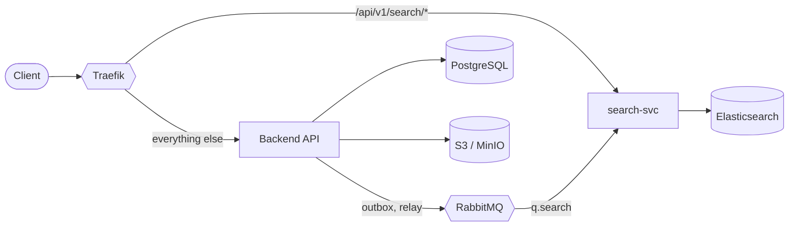

# Architecture

## What this service is

`search-svc` answers file search queries from its own Elasticsearch index. It is
deployed separately from `backend` and shares no code with it.

The property that makes the separation safe:

> **`search-svc` owns no data.** It holds a *derived view* — a copy of file
> metadata rearranged for fast lookup. Wipe the index entirely and nothing is
> lost; replay the events and it rebuilds.

PostgreSQL remains the source of truth for what files exist and who owns them.
Object storage remains the source of truth for bytes.

| | Source of truth | Rebuildable? |
| --- | --- | --- |
| File bytes | S3 / MinIO | No |
| File metadata, ownership | PostgreSQL | No |
| Search index | Elasticsearch | **Yes — replay events** |

## What it must never do

These are enforced by configuration, not by discipline:

- **No PostgreSQL.** The service is given no database credentials. Its settings
  (`app/config.py`) define `SECRET_KEY`, `FRONTEND_HOST` and
  `BACKEND_CORS_ORIGINS` — there is no `POSTGRES_*` anywhere. The index is built
  exclusively from events.
- **No object storage.** It never sees file bytes and issues no download URLs.
- **No ingress to Elasticsearch.** The cluster carries no Traefik labels and
  publishes no port in production; `compose.override.yml` publishes one for local
  debugging only, matching how `db` and `rabbitmq` are treated.
- **No calls to `backend`.** Token verification is local; there is no callback on
  the request path.
- **No imports from the backend package.** JWT verification (`app/security.py`)
  and ltree path validation (`app/schemas.py`) are deliberate ten-line
  reimplementations, not shared imports.

This is what keeps the split from becoming a distributed monolith. See phase
document decisions 1 and 2.

## Where it sits



Two touch points, both of which already existed before this service:

1. **Traefik** splits traffic by path — one routing rule, no new gateway
   component. This is what satisfies ROADMAP 8.3.
2. **The broker** gains one more queue binding, the same shape as the existing
   email and in-app consumers.

`search-svc` connects to nothing else.

## Routing

**Live.** Traefik matches on host *and* path prefix, at a higher priority than
the backend catch-all:

```
Host(`api.${DOMAIN}`) && PathPrefix(`/api/v1/search`)   priority 100  → search-svc
Host(`api.${DOMAIN}`)                                                 → backend
```

A malformed rule here is the one change in this service that can break
everything: get the priority or syntax wrong and all API traffic lands on a
service that returns empty arrays. Any change to these labels must be verified in
both directions — a search path *and* an ordinary backend path.

## Reaching the service

**Live.**

| Environment | How |
| --- | --- |
| Local | Through Traefik at `http://api.localhost/api/v1/search/*` |
| Production | Through Traefik at `https://api.${DOMAIN}/api/v1/search/*` |

The frontend uses the Traefik origin for **all** API calls, so local and
production routing behave identically. `backend` remains published directly on
`http://localhost:8000` for debugging only — requests sent there bypass Traefik
and will not reach `search-svc`.

## Consistency

**Live.** The index is eventually consistent. A newly uploaded file appears in
the index once the indexer has consumed its event, typically within seconds.

A *lost* event is different from a delayed one. Because the service never reads
PostgreSQL, it cannot detect that its view has diverged — a dropped delete leaves
a permanently stale entry, and acting on it returns a 404 from `backend`.
Reconciliation is therefore always backend-driven: `backend` replays events.
`search-svc` never compares itself against the source of truth.

One known gap is accepted deliberately: deleting a user cascade-deletes their
files in PostgreSQL without emitting any event, so their documents remain in the
index. See phase document decision 13.
