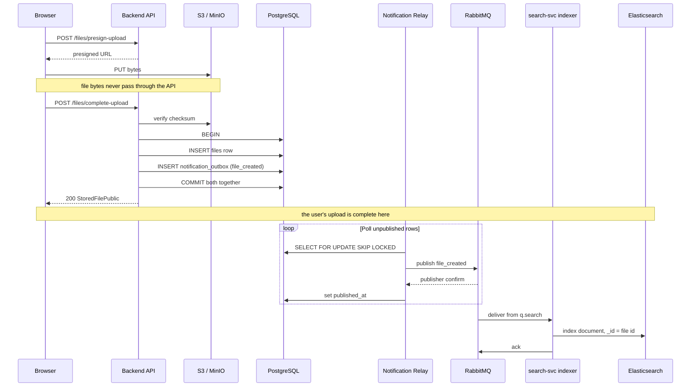
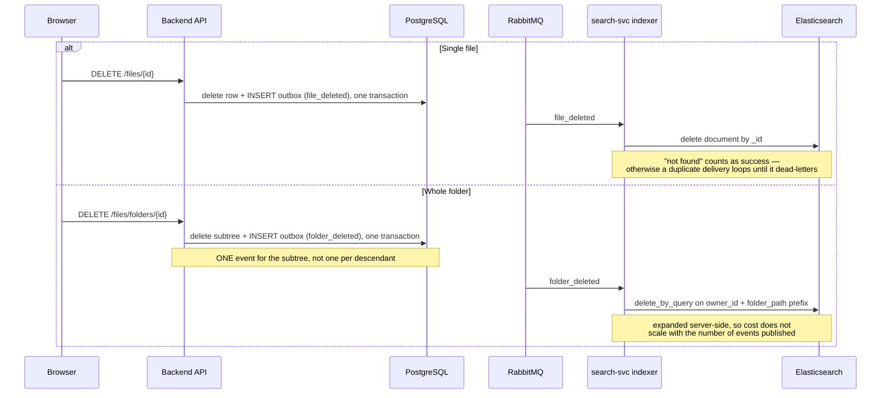

# Indexing Sequence

How a file reaches the search index, and how it leaves. Everything below the
dividing line happens after the user's request has returned, so upload latency is
unaffected.

**Live.** Delivered by #133. The `search-indexer` compose service runs the
`search-svc` image with `command: python -m app.indexer`, and writes to the
`files-v1` index through the `files` alias.

## Upload



The backend change is **one extra INSERT** inside a transaction that already
exists. If Elasticsearch is down when the indexer runs, the message stays queued
and is retried; the upload still succeeded.

## Delete



## Guarantees

```
file mutation → outbox     ATOMIC          same transaction
outbox → broker            at-least-once   relay may republish after a crash
broker → indexer           at-least-once   ack-based redelivery
──────────────────────────────────────────────────────────────
end to end                 at-least-once
```

The indexer must therefore tolerate seeing any event twice. Indexing by file id
is naturally idempotent; deletes must treat a missing document as success.

A *lost* event is a different matter. `search-svc` cannot detect divergence,
because it never reads PostgreSQL — so recovery is always backend-driven, by
replaying events. That is also how the backfill of pre-existing files works
(**planned, #134**): `backend` replays `file_created` for every existing file
through this same path, rather than `search-svc` reaching into the database.

## Index creation

The index is created on first write through `ensure_index`, always via the
`files` alias rather than the concrete `files-v1` name, so a future mapping
change can reindex into `files-v2` and swap the alias without downtime.

`number_of_replicas` is set to `0` deliberately. A single-node cluster can never
satisfy a positive replica count, so leaving the default would block every index
creation for around thirty seconds waiting on shard allocation that cannot
succeed.
