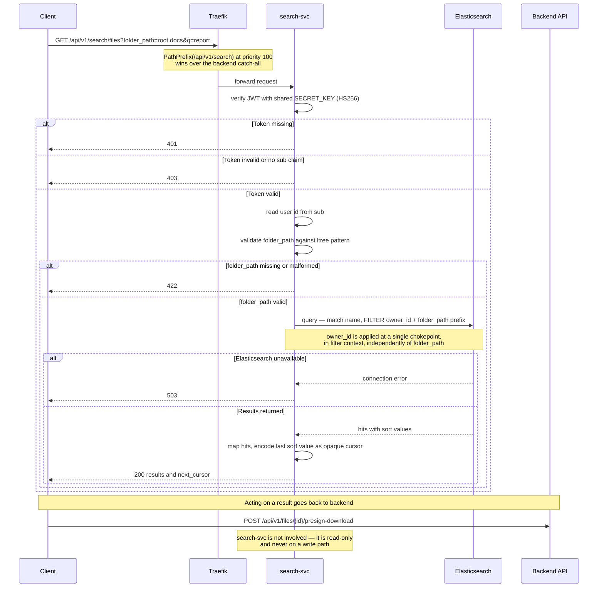

# Search Query Sequence

How a search request travels from the client to a result set. Traefik selects the
service by path prefix; `search-svc` verifies the token locally and never calls
`backend` or PostgreSQL.

**Live.** The Elasticsearch steps below are implemented (#134).

## The shape to notice

**Search finds, backend serves.** A search result is an id plus display metadata.
The moment the user acts on one — download, share, delete — traffic returns to
`backend` through the normal path.

The security-critical line is the `owner_id` filter. A search endpoint returns a
*list*, so one missing filter leaks many records at once rather than one. It is
applied in filter context, at a single place every query routes through, and
independently of `folder_path` — passing another user's folder path returns
nothing rather than their files.
